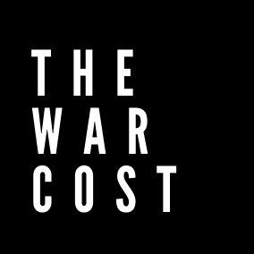

## About War Costs

A website based on Laravel that acts as a counter for war losses between Ukraine and Russia. The code and idea is inspired by the Egyptian initiative following the Egyptian revolution.

## Local Setup

- Make sure you have the latest version of docker and docker-compose installed on your machine
- Download the package `git clone https://github.com/hmones/warcosts.git`
- From the root directory run `composer install` to install vendor dependencies (you should have composer installed on your machine)
- Create an environment file for your application by copying `.env.example` to `.env`
- From the root directory run `vendor/bin/sail up -d` to run the application using docker
- Create a unique application key by running `vendor/bin/sail artisan key:generate`
- Make sure you have the `credentials.json` file in the root of your public directory
- The website can be accessible through `localhost:80`

## Contributing

If you would like to contribute to the project, create an issue on the github repository.

## Security Vulnerabilities

If you discover a security vulnerability within the application, please send an e-mail to Haytham Mones via [hello@haytham.me](mailto:hello@haytham.me). All security vulnerabilities will be promptly addressed.

## License

The application is open-sourced software licensed under the [MIT license](https://opensource.org/licenses/MIT).
